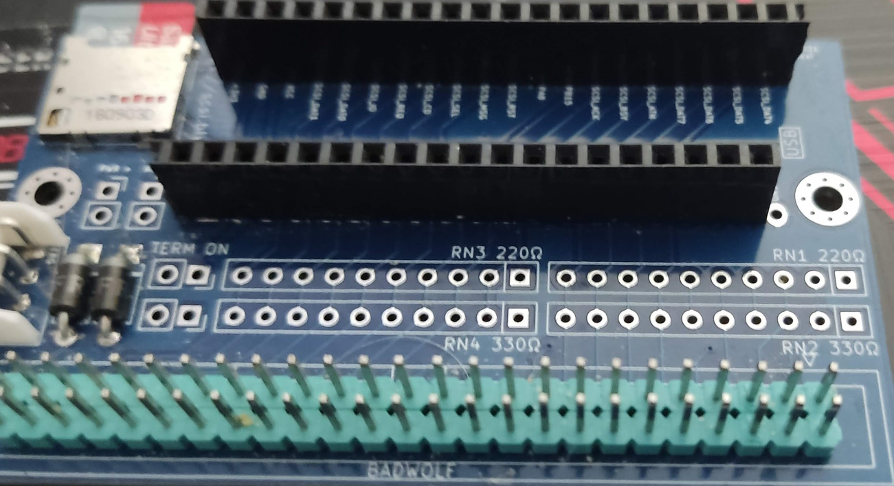

ZuluSCSI on BlueSCSI with Bluepill+ GD32F303 
==========================================

This specific port is related to using a BlueSCSI interposer board
with WeACT studio's Bluepill+ boards. Specifically the GD32F303 variant

BlueSCSI Modifications required
----------------------------------

An almost stock BlueSCSI board will support the Bluepill+ form factor,
during assembly it will require using one 20 pin header and one 19 pin 
header where the bluepill plugs in. This is because one ground pin on 
the older bluepills is a +3.3V on the bluepill+. Cutting a 40 pin header
in half (as you lose one pin) works out perfectly for this.

Simply leave the one pin at the USB end of the bluepill, closest to the SCSI
connector disconnected and the bluepill+ boards will plug in without causing 
any issues.

An example can be seen in 

Installing Firmware
----------------------------------

In order to install the firmware onto the bluepill+, an stlinkv2 (or clone) can
be used. Simply wire up the SWD and power between the two then within VScode+PIO
browse to the platformio tab. Expand the tasks under BlueScsiGD32F303 and select 
"Upload". If all is working correctly, the firmware should be built and flashed
onto the board.

Why would I use this over BlueSCSI?
----------------------------------

I found the compatibility between the original BlueSCSI and non-Mac hardware
to be...errr, iffy. This firmware has worked without fault for me with Sun4M 
and Sun4C hosts, neither of which work with BlueSCSI, terminators weren't even 
needed. The slightly higher powered GD32F303 chip provides better support for
the features the ZuluSCSI firmware provides.
